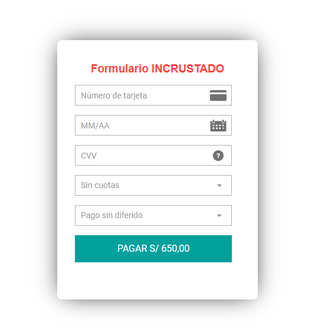
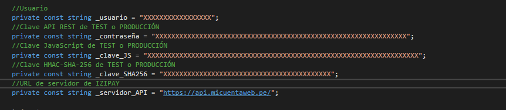
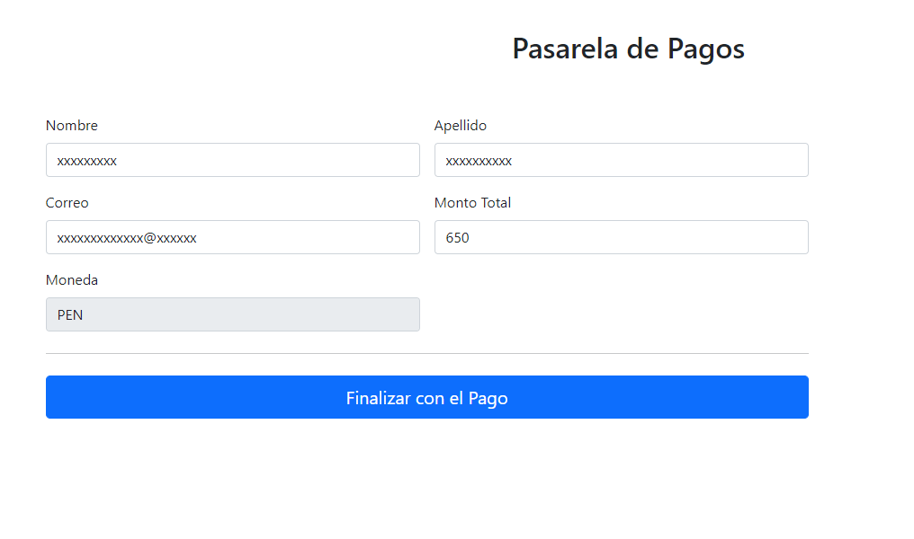

# Embedded-PaymentForm-T1.Net

Ejemplo del formulario incrustado de Izipay con C# .NET, para poder ejecutar el siguiente ejemplo seguir los pasos del presente manual.



<a name="Requisitos_Previos"></a>

## Requisitos Previos

* Instalar Visual Studio [Aquí](https://visualstudio.microsoft.com/es/)
* Version de .NET CORE de 3 en adelante
* Extraer credenciales del Back Office Vendedor. [Guía Aquí](https://github.com/izipay-pe/obtener-credenciales-de-conexion)

## 1.- Descargar
Descargar el proyecto .zip haciendo click [Aquí](https://github.com/izipay-pe/Embedded-PaymentForm-T1-React/archive/refs/heads/main.zip) o clonarlo desde Git.
```sh
git clone https://github.com/izipay-pe/Embedded-PaymentForm-T1.Net.git
``` 

## 2.- Obtener Claves
* Obtener claves de integración, [Ver ejemplo](https://github.com/izipay-pe/obtener-credenciales-de-conexion#readme)
 
## 3.- Configurar claves
* Obtener claves de API REST desde guía de integración ver [Requisitos Previos](#Requisitos_Previos).
* Editar el archivo `PaymentModel.cs` con las claves de su Back Office Vendedor
```   
        private const string _usuario = "~~CHANGE_ME_USER~~";
        private const string _contraseña = "~~CHANGE_ME_KEY~~";
        private const string _clave_JS = "~~CHANGE_ME_PUBLIC_KEY~~";
        private const string _clave_SHA256 = "~~CHANGE_ME_KEY_HMAC-SHA-256~~";
        private const string _servidor_API = "https://api.micuentaweb.pe/";

``` 


## 4.- Correr Proyecto
* IIS Express
* Correr proyecto con el Explorador Web de su preferencia

## 5.- Implementar IPN

* Ver manual de implementacion de la IPN [Aquí](https://secure.micuentaweb.pe/doc/es-PE/rest/V4.0/kb/payment_done.html)
* Ver el ejemplo de la respuesta IPN [Aquí](https://github.com/izipay-pe/Redirect-PaymentForm-IpnT1-PHP)

## 6.- Demo

